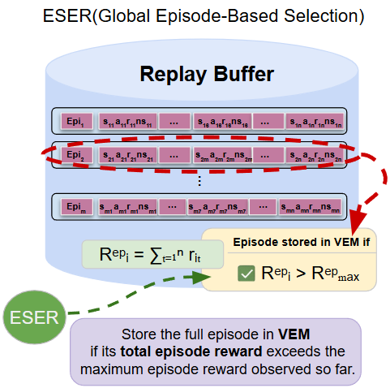
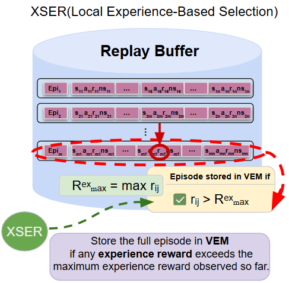
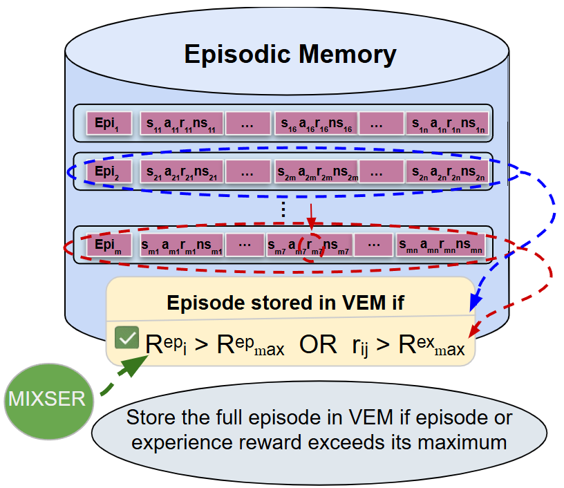

# Repetition-RL

<p align="center">
  
</p>

<p align="center">
  <b>Repetition as a Third Mode of Interaction in Reinforcement Learning</b>
</p>

---

# Overview

`Repetition` is a reinforcement learning research framework that introduces **repetition as a third mode of interaction** alongside:

* Exploration
* Exploitation

Traditional off-policy RL algorithms reuse past experiences only during optimisation through replay-buffer sampling. In contrast, Repetition directly modifies the interaction process itself by allowing agents to deliberately re-execute previously valuable behaviours in the environment.

The framework studies how repeating successful trajectories during interaction can improve:

* sample efficiency
* behavioural consolidation
* exploration guidance
* stability of learning

This repository includes implementations of:

* **IER**: Instant Episode Repetition
* **SER**: Spaced Episode Repetition

  * **ESER**: Episode-based SER
  * **XSER**: Transition-based SER
  * **MSER**: Mixed SER

The framework is evaluated on continuous-control RL benchmarks and robotic manipulation tasks.

---

# Research Paper

This repository accompanies the journal paper:

> **Beyond Exploration and Exploitation: Repetition as a Third Mode of Interaction in Reinforcement Learning**

```bibtex
@article{yamani2026repetition,
  title={Beyond Exploration and Exploitation: Repetition as a Third Mode of Interaction in Reinforcement Learning},
  author={Yamani, Hoda and MacDonald, Bruce and Williams, Henry},
  journal={Under Review},
  year={2026}
}
```

---

# Core Idea

In standard RL, agents alternate between:

1. **Exploration**

   * discovering new behaviours

2. **Exploitation**

   * following the current policy

This work introduces:

3. **Repetition**

   * deliberate re-execution of previously successful behaviours

Unlike replay buffers that only reuse transitions during gradient optimisation, repetition changes how the agent interacts with the environment itself.

---

# Methods

# Instant Episode Repetition (IER)

<p align="center">
  
</p>

IER immediately repeats newly discovered valuable episodes.

When a useful trajectory is detected, the corresponding action sequence is re-executed directly in the environment for several repetitions.

## Key Characteristics

* immediate behavioural reinforcement
* no additional episodic memory required
* lightweight integration into off-policy RL
* suitable for fast-learning environments

## IER Selection Strategies

### Episode-Reward IER

Episodes are selected using cumulative episode reward.

This reinforces globally successful trajectories.

### Transition-Reward IER

Episodes are selected using high local transition rewards.

This captures locally important experiences even when the full episode return is not optimal.

---

# Spaced Episode Repetition (SER)

<p align="center">
  
</p>

SER introduces delayed behavioural reuse through a long-term episodic memory called:

> **Virtual Episode Memory (VEM)**

Instead of repeating trajectories immediately, SER periodically revisits valuable episodes according to a repetition schedule.

## Why SER?

SER separates discovery and reuse over time.

This enables:

* delayed behavioural consolidation
* periodic trajectory reinforcement
* long-term reuse of important behaviours
* reduced dependence on recent experience only

---

# SER Variants

# ESER

## Episode-Based SER

<p align="center">
  
</p>

ESER stores episodes according to cumulative episode reward:

```math
R_i^{ep} > R_{max}^{ep}
```

The method prioritises globally successful trajectories across the entire episode.

---

# XSER

## Transition-Based SER

<p align="center">
  
</p>

XSER selects episodes using locally important transition rewards.

Instead of relying only on total episode return, XSER captures trajectories containing important local events.

This is useful when sparse or local rewards are important for learning.

---

# MSER

## Mixed SER

<p align="center">
  
</p>

MSER combines:

* global episode-reward selection
* local transition-reward selection

This enables the framework to preserve:

* globally successful trajectories
* locally salient experiences

Two mixed variants are included:

* `mixed`
* `simple_mixed`

---

# Repository Structure

```text
Repetition/
│
├── algorithms/
├── networks/
├── memory/
├── environments/
├── train_loops/
│
├── train_loops/base/
├── train_loops/ier/
├── train_loops/ser/
│   ├── eser/
│   ├── xser/
│   └── mser/
│
├── configs/
│   ├── standard/
│   ├── ier/
│   └── ser/
│
├── utils/
├── analysis/
├── results/
├── assets/
├── docs/
├── train.py
└── requirements.txt
```

---

# Supported Algorithms

| Algorithm | Description                                     |
| --------- | ----------------------------------------------- |
| TD3       | Twin Delayed Deep Deterministic Policy Gradient |
| SAC       | Soft Actor-Critic                               |
| TD3SIL    | TD3 with Self-Imitation Learning                |
| SACSIL    | SAC with Self-Imitation Learning                |
| ReTD3     | Repetition-based TD3                            |
| ReSAC     | Repetition-based SAC                            |

---

# Supported Repetition Modes

| Framework | Strategy          | Description                                        |
| --------- | ----------------- | -------------------------------------------------- |
| IER       | episode_reward    | Immediate repetition using episode return          |
| IER       | transition_reward | Immediate repetition using local transition reward |
| SER       | episode_reward    | ESER                                               |
| SER       | transition_reward | XSER                                               |
| SER       | mixed             | MSER                                               |
| SER       | simple_mixed      | Simple MSER                                        |

---

# Environments

## MuJoCo / OpenAI Gym

* Ant-v4
* HalfCheetah-v4
* Humanoid-v4
* Walker2d-v4
* Hopper-v4
* Pendulum-v1

## DeepMind Control Suite

* Walker-Walk
* Cheetah-Run
* Cartpole-Swingup
* Finger-Turn-Hard
* Reacher-Hard

## Real-World Robotics

* Dynamic Object Translation
* Two-finger robotic manipulation platform

---

# Installation

Clone the repository:

```bash
git clone https://github.com/UoA-CARES/Repetition.git

cd Repetition
```

Create environment:

```bash
conda create -n Repetition python=3.10

conda activate Repetition
```

Install dependencies:

```bash
pip install -r requirements.txt
```

---

# Running Experiments

Experiments are configured using YAML files.

The main command is:

```bash
python3 train.py run --config <config_path>
```

---

# Standard RL

## TD3

```bash
python3 train.py run \
--config configs/standard/td3_halfcheetah.yaml
```

## SAC

```bash
python3 train.py run \
--config configs/standard/sac_halfcheetah.yaml
```

---

# IER Experiments

## Episode-Reward IER

```bash
python3 train.py run \
--config configs/ier/retd3_episode_reward.yaml
```

## Transition-Reward IER

```bash
python3 train.py run \
--config configs/ier/retd3_transition_reward.yaml
```

---

# SER Experiments

## ESER

```bash
python3 train.py run \
--config configs/ser/eser_retd3.yaml
```

## XSER

```bash
python3 train.py run \
--config configs/ser/xser_retd3.yaml
```

## MSER

```bash
python3 train.py run \
--config configs/ser/mser_retd3.yaml
```

## Simple MSER

```bash
python3 train.py run \
--config configs/ser/simple_mser_retd3.yaml
```

---

# YAML Configuration Structure

Example configuration:

```yaml
experiment:
  name: mser_retd3_halfcheetah

repetition:
  framework: SER
  selection_strategy: mixed

environment:
  gym: openai
  task: HalfCheetah-v4
  domain: ""

algorithm:
  name: ReTD3

training:
  seeds: [10, 20, 30, 40, 50]
```

---

# Logging and Outputs

Training outputs are automatically stored under:

```text
~/repetition_rl_logs/
```

Each experiment saves:

```text
env_config.json
train_config.json
alg_config.json

data/
models/
figures/
videos/
```

---

# Features

* repetition-based environment interaction
* Virtual Episode Memory (VEM)
* episode-level behavioural reuse
* TD3 and SAC integration
* SER and IER frameworks
* mixed repetition strategies
* delayed repetition scheduling
* robotic manipulation evaluation
* heatmap and sensitivity analysis
* replay-buffer compatible design

---

# Acknowledgements

This work was developed within the CARES Robotics Lab at the University of Auckland.

---

# License

MIT License

