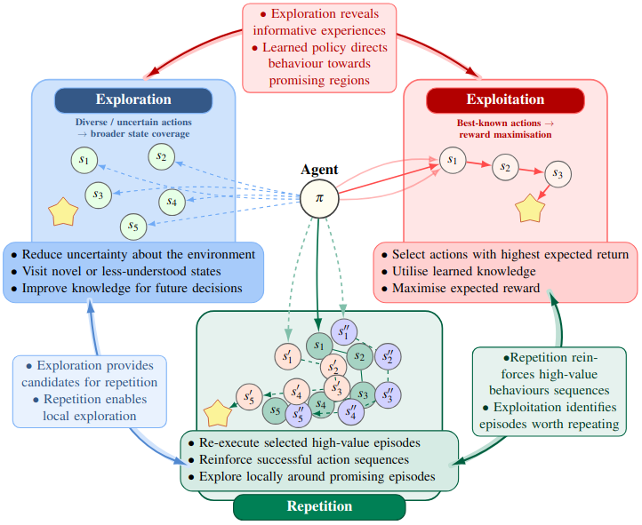
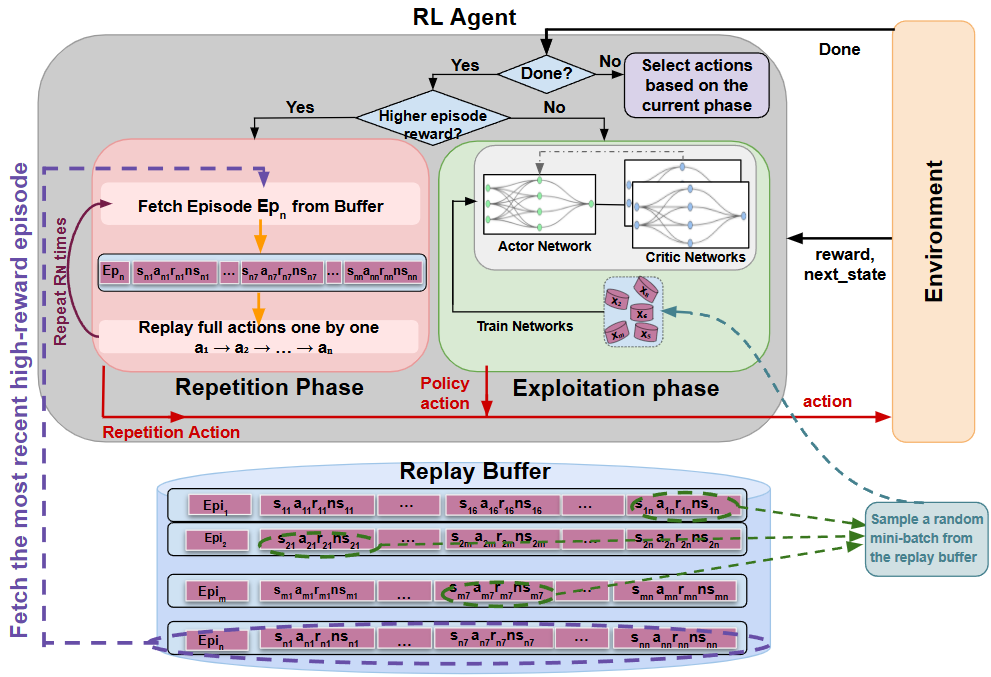
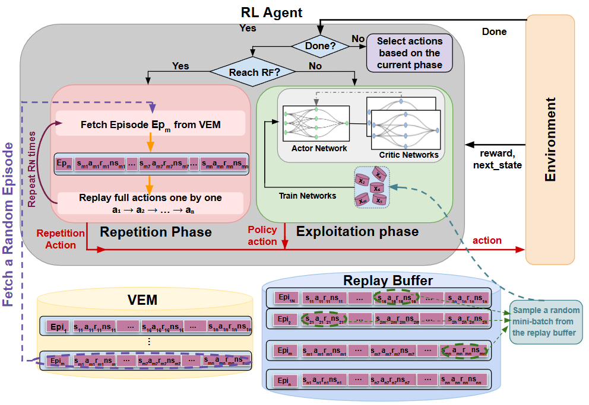

# Repetition-RL


## Overview

Repetition-RL is a research framework that introduces **repetition as a third mode of interaction** in reinforcement learning alongside:

- Exploration
- Exploitation
- Repetition

Instead of relying solely on replay-buffer sampling, agents actively re-execute previously successful action sequences during interaction to reinforce valuable behaviours and improve sample efficiency.

This repository contains implementations of:

- **IER**: Instant Episode Repetition
- **SER**: Spaced Episode Repetition
  - **ESER**: Global episode-based selection
  - **XSER**: Local experience-based selection
  - **MSER**: Combined selection

The framework is evaluated across continuous-control benchmarks and real-world robotic manipulation tasks.

---

# Core Idea

<p align="center">
  
</p>

Traditional RL alternates between:

- **Exploration**: discovering new behaviours
- **Exploitation**: following the current policy

This work introduces:

- **Repetition**: deliberate re-execution of successful episodes

Unlike replay buffers that reuse transitions only during optimisation, repetition modifies the interaction process itself.

---

# Methods

## Instant Episode Repetition (IER)

<p align="center">
  
</p>

IER immediately re-executes newly discovered high-reward episodes.

### Key Characteristics

- Immediate behavioural reinforcement
- No additional episodic memory required
- Simple integration into off-policy RL
- Effective in fast-learning environments

---

## Spaced Episode Repetition (SER)

<p align="center">
  
</p>

SER introduces temporally spaced behavioural reuse using a dedicated episodic memory called:

> **Virtual Episode Memory (VEM)**

SER periodically revisits valuable episodes according to a repetition schedule.

---

# SER Family

## ESER

### Global Episode-Based Selection

Episodes are selected according to cumulative episode reward:

```math
R_i^{ep} > R_{max}^{ep}
```

This strategy reinforces globally successful behaviours over the full episode trajectory.

---

## XSER

### Local Experience-Based Selection

Episodes are selected using the maximum transition reward observed within the episode.

<p align="center">

</p>

This strategy captures locally important transitions that may not produce the highest overall episode return.

---

## MSER

### Combined Selection

MSER combines both global episode reward and local transition reward criteria.

<p align="center">

</p>

This allows the framework to retain both globally successful behaviours and locally salient experiences.

---

# Repository Structure

```text
repetition-rl/
│
├── methods/
│   ├── ier/
│   └── ser/
│       ├── eser/
│       ├── xser/
│       └── mser/
│
├── train_loops/
├── memory/
├── environments/
├── agents/
├── configs/
├── scripts/
├── analysis/
├── results/
├── notebooks/
└── docs/
```

---

# Features

- Immediate and spaced repetition mechanisms
- Virtual Episode Memory (VEM)
- Episode-level behavioural reuse
- TD3 and SAC integration
- Real-world robotic evaluation
- Heatmap and sensitivity analysis
- Adaptive repetition scheduling
- Delayed repetition variants
- Near-neighbour repetition mechanisms

---

# Supported Algorithms

- TD3
- SAC
- SIL-TD3
- SIL-SAC

---

# Environments

## Simulation

- Ant-v4
- HalfCheetah-v4
- Humanoid-v4
- Walker-Walk
- Cheetah-Run
- Cartpole-Swingup
- Finger-Turn-Hard
- Reacher-Hard

## Real-World Robotics

- Dynamic Object Translation Task
- Two-finger robotic manipulation platform

---

# Installation

```bash
git clone https://github.com/UoA-CARES/repetition-rl.git

cd repetition-rl

pip install -r requirements.txt
```

---

# Example Usage

## Train IER-TD3

```bash
python train.py --algorithm ReTD3 --config configs/ier/td3.yaml
```

## Train ESER-SAC

```bash
python train.py --algorithm RESAC --config configs/ser/eser/sac.yaml
```

---

# Experimental Analysis

The repository includes:

- Learning curves
- Normalised AUC analysis
- RF/RN sensitivity analysis
- Heatmap visualisations
- VEM-capacity studies

---

# Citation

```bibtex
@phdthesis{yamani2026repetition,
  title={Repetition as a Third Mode of Interaction in Reinforcement Learning},
  author={Yamani, Hoda},
  school={University of Auckland},
  year={2026}
}
```

---

# Acknowledgements

This work was developed within the CARES Robotics Lab at the University of Auckland.

---

# License

MIT License

